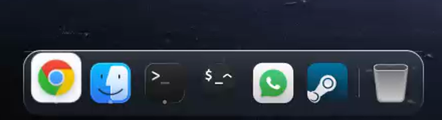

<p align="center">
  <video src="https://github.com/hisnameismarco/odock/raw/refs/heads/main/demo-v1.1.0.mp4" poster="https://raw.githubusercontent.com/hisnameismarco/odock/main/preview.png" autoplay loop muted playsinline width="960">
    <a href="demo-v1.1.0.mp4">Watch the ODock v1.1.0 demo</a>
  </video>
</p>

# ODock

A standalone fisheye dock for the Omarchy shell with macOS-style icon magnification, smooth animations, intelligent hide/reveal, window cycling, App Expose, and full customization, all in a Quickshell plugin.

On top of the classic magnifier, autohide/dodge, window cycling, four edge positions, drag-to-reorder and theming, ODock adds App Expose, a launch bounce, and macOS-style glass, badge and indicator styling.

Features:

- Four edges with flexible positioning (start/center/end)
- Smart hide: pressure-reveal hotspot with dodge for overlapping windows
- Window controls: scroll to cycle through windows, click to minimize/focus/launch
- **App Expose** — click-and-hold an item (or pick "Show All Windows" from its context menu) for a thumbnail grid of that app's windows
- **Launch bounce** — clicking an app that is not running yet hops its icon a couple of times, the way macOS does
- macOS-style running dots, red count badges, a hover name bubble, and a liquid-glass sheen on the card

## Version 1.1.0

Coordinated glass styling with [OLauncher](https://github.com/hisnameismarco/OLauncher): 65% background opacity, 24 px rounded corners, softer borders and top highlights, a soft surface shadow, and quiet icon hover highlights. Reflow defaults to 140 ms. Explicit user settings continue to override these defaults.

To match the new appearance on an existing installation, set these keys in the `odock` entry of `~/.config/omarchy/shell.json`:

```json
{
  "backgroundOpacity": 0.65,
  "borderOpacity": 0.22,
  "cornerShape": "rounded",
  "cornerRadius": 24,
  "animation": 140
}
```

[Watch the v1.1.0 demo (MP4)](demo-v1.1.0.mp4). Recorded in an isolated demo shell, with a neutral stage and real pointer motion across the icons. The same file is attached to the [v1.1.0 release](https://github.com/hisnameismarco/odock/releases/tag/v1.1.0).

## Requirements

- Omarchy (Hyprland + the Quickshell-based `omarchy-shell`)
- `jq` — used by the configurator

## Install

```bash
omarchy plugin add https://github.com/hisnameismarco/odock --enable
```

That's the whole install: the repo root is the plugin. The dock appears with
a starter set matched to your machine — the Omarchy Menu, a file manager,
your default terminal, and your default browser — plus your running apps.
Two optional extras the plugin manager doesn't do:

- **Blur behind the dock** — with compositor blur already enabled, add the rule below to your Hyprland Lua configuration. It targets the current `omarchy-odock` namespace; rules for older docks do not apply. The optional [hypr/dock.lua](hypr/dock.lua) helper also configures global blur and disables blur for ordinary windows.
- **The configurator on your PATH** — the dock always runs its bundled
  copy, but for terminal use link it:
  `ln -s ~/.config/omarchy/plugins/odock/bin/odock-config ~/.local/bin/`

For the dock layer only:

```lua
hl.layer_rule({ match = { namespace = "^omarchy-odock$" }, blur = true, ignore_alpha = 0.3 })
```

Validate with `hyprctl reload` and `hyprctl configerrors`.

### From a checkout

```bash
git clone https://github.com/hisnameismarco/odock ~/src/odock
cd ~/src/odock
./install.sh
```

`install.sh` is idempotent, backs up anything real it displaces, and takes
`--dry-run` if you want to see the plan first. Everything except
`shell.json` is a symlink back into this checkout; the dock's entry in
`shell.json` is merged in, staged through a temp file and only swapped in
once `jq` confirms the result still parses. An existing dock entry is never
overwritten unless you pass `--replace-config`.

## Configure

```bash
odock-config --help      # or right-click the dock
```

The configurator writes straight into the dock's entry in `shell.json`, which
the shell re-reads on save — changes show up immediately, no restart.

Settings on the plugin entry:

| Key | Meaning |
|-----|---------|
| `items` | The pinned section; `{"spacer": true}` draws a divider |
| `edge` | Screen edge: `"bottom"` (default), `"top"`, `"left"`, or `"right"` — left/right give a vertical dock |
| `align` | Placement along that edge: `"center"` (default), `"start"`, or `"end"` |
| `iconSize` | Icon edge length in px |
| `zoom` | Fisheye strength (0–1; 0.45 default) |
| `zoomRaise` | How much of its growth an icon lifts out of the bar (0.5 default) |
| `magnify` | The continuous lens (default true) |
| `animation` | Reflow animation length, ms (default 140) |
| `spacing`, `padding` | In the card |
| `backgroundOpacity` | Card opacity (0–1) |
| `glyphScale` | Nerd Font glyph ink as a fraction of the slot |
| `tiles`, `tileRadius`, `tileInset`, `tileOpacity` | Draw items as themed tiles |
| `border`, `cornerRadius` | Card chrome |
| `autohide` | `false` keeps the dock always visible (default true) |
| `dodge` | Intelli-hide from overlapping / fullscreen windows (default true) |
| `pressure` | Reveal delay collapses to zero on the edge hotspot (default true) |
| `revealDelay`, `hideDelay` | Hover-in and hover-out delays, ms |
| `hotspotFullWidth`, `hotspotHeight` | Size of the trigger zone on the edge |
| `showWhenEmpty` | Keep the card up on empty workspaces |
| `runningIndicator` | `"dot"` (default), `"line"`, or `"none"` |
| `showRunning` | The running-apps section (default true) |
| `labels` | Label pill beside the hovered item (default true) |
| `tintIcons`, `tintRunning`, `monochrome` | Icon colorization (defaults false / true / false) |
| `glyphColor` | `"accent"` or the default text color |
| `fullWidth`, `edgeGap` | Card length along the edge |

Item forms in `items[]`:

- `{ "desktop": "kitty" }` — launch a desktop entry
- `{ "exec": "cmd", "icon": "…", "label": "…" }` — run any command
- `{ "exec": "cmd", "glyph": "NICON" }` — a Nerd Font glyph instead of an icon
- `{ "showApps": true }` — the shell app menu
- `{ "trash": true }` — open the trash in the file manager
- `{ "spacer": true }` — divider rule
- `{ "when": "<cmd>" }` — show only while the command exits 0

### Programmatic CLI

The pin badge, context menu, and drag-to-reorder all persist through
`odock-config` subcommands — one validated writer for shell.json
(indices 0-based):

```
odock-config pin <appId> [index]
odock-config unpin <index>
odock-config move <from> <to>
odock-config set-item <index> <json>
odock-config add <json> [index]
odock-config set <key> <json>     # dock-level; null unsets
```

## Development

The shell watches `~/.config/omarchy/plugins`, but `inotifywait -r` does not
traverse symlinks — with the plugin directory linked into a checkout, apply
QML edits by hand with:

```bash
omarchy-shell shell rescanPlugins      # or: omarchy restart shell
```

Edits to `shell.json` need none of this — the shell hot-reloads that on save.

## Layout

```
./          the shell plugin itself (manifest.json + Dock.qml at the root,
            so the repo installs directly via `omarchy plugin add`)
bin/        odock-config, the programmatic configurator
hypr/       dock.lua — blur and layer rules for Hyprland
config/     shell.dock.json — the dock entry's style defaults for shell.json
            (items are resolved per user at install: Menu, Files, the
            default terminal and browser)
```

The heat is in `Dock.qml`: a 16 ms loop eases each cell's scale toward the
lens targets (narrow quadratic zoom about `pointerMain`, reported by each
dock window's `HoverHandler`, mapped to row coordinates) while keeping
positions, the card and the border frozen.  `DockItem.qml` places and
dresses each cell.
`RunningModel.qml` derives the running section, `ContextMenu.qml` the
right-click menu.

## Uninstall

```bash
./uninstall.sh                 # keeps your dock settings in shell.json
./uninstall.sh --purge-config  # drops them too
```

It only removes symlinks that point back into this checkout, so anything you
installed another way is left alone.

## License

MIT
